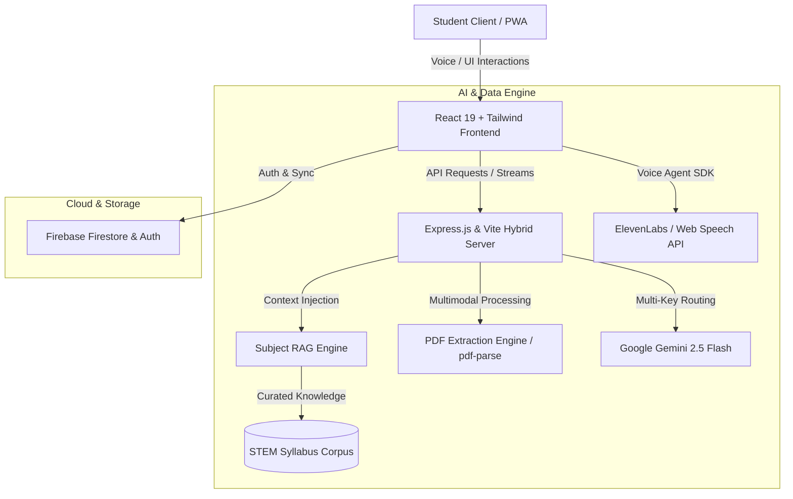

# 🎓 EduSwathi — AI Learning Companion & STEM Socratic Tutors

<div align="center">


[](https://eduswathi.ai.studio)

**Your Personal AI Learning Companion with Dedicated STEM Socratic Tutors, Multimodal Smart Notes, and Cognitive Analytics Dashboard.**

[](https://eduswathi.ai.studio)
[](https://react.dev/)
[](https://www.typescriptlang.org/)
[](https://vitejs.dev/)
[](https://tailwindcss.com/)
[](https://ai.google.dev/)
[](https://elevenlabs.io/)
[](https://firebase.google.com/)
[](LICENSE)

[🌐 Live Demo](https://eduwathi.ai.studio) • [Features](#-key-features) • [Architecture](#-system-architecture) • [Getting Started](#-getting-started) • [Environment Variables](#-environment-variables) • [Tech Stack](#-tech-stack)

</div>

---

## 🌐 Live Demo

Explore the live application directly in your browser:
👉 **[https://eduswathi.ai.studio](https://eduswathi.ai.studio)**

---

## 🌟 Overview

**EduSwathi** is an intelligent, full-stack pedagogical platform engineered to transform how students learn, master, and revise complex STEM subjects. Powered by **Google Gemini 2.5 Flash**, **ElevenLabs Voice AI**, and a custom **Subject-Specific RAG (Retrieval-Augmented Generation)** knowledge pipeline, EduSwathi provides individualized tutoring that mimics an experienced academic mentor.

Instead of simply outputting answers, EduSwathi employs guided **Socratic inquiry**, breaking challenging concepts down into intuitive first principles across Mathematics, Physics, Chemistry, Biology, and Computer Science.

---

## ✨ Key Features

### 🧠 1. Dedicated STEM Socratic Tutors
Specialized AI tutors tuned with custom domain pedagogy and grounded with textbook knowledge:
- **📐 Mathematics**: Step-by-step proofs, calculus, linear algebra, theorem verifications, and derivation checks.
- **⚛️ Physics**: Conceptual intuition, SI unit enforcement, vector mechanics, electromagnetism, and formula grounding.
- **🧪 Chemistry**: Reaction mechanisms (SN1/SN2), thermodynamics, orbital geometry, and balanced stoichiometry.
- **🧬 Biology**: Cellular respiration, genetics, diagrams, molecular inheritance, and anatomical analogies.
- **💻 Computer Science**: Big-O asymptotic analysis, algorithm visualization, data structures, and code debugging.

### 📚 2. Subject RAG (Retrieval-Augmented Generation)
- Curated subject corpus covering core curricula, high-yield formulas, and NCERT textbook syllabus references.
- Multi-key API architecture (`MATH_API_KEY`, `PHYSICS_API_KEY`, etc.) allowing quota isolation and dedicated performance.
- Streaming responses with real-time markdown and mathematical formula rendering.

### 🎙️ 3. Conversational Voice Learning Companion
- Hands-free voice sessions powered by **ElevenLabs** and native **Web Speech APIs**.
- Real-time voice welcome agent, personalized student greetings, and oral self-quizzing.
- Interactive voice modal with audio waveform visualizer and text-to-speech feedback.

### 📑 4. Multimodal Smart Notes & PDF Parser
- Upload lecture slides, research papers, or syllabus PDFs.
- Dual-layer parsing engine using `pdf-parse` for textual density and **Gemini 2.5 Multimodal Vision** for complex documents and diagrams.
- Instant automated generation of:
  - 🎯 Executive Overviews
  - 🔑 Key Concepts & Definitions
  - ⚡ Core Formulas & Mechanics
  - 📌 High-Yield Takeaways
  - 🧠 Active Recall Self-Quizzes

### 📊 5. Cognitive Analytics & Dashboard
- **Real-Time Progress Metrics**: Study streaks, retention curve trackers, and subject mastery radars using Recharts.
- **Pomodoro & Focus Timers**: Deep work session monitoring with automatic interval alerts.
- **Syllabus Roadmap**: Dynamic chapter completion checklists and exam weightage indicators.

### 🎯 6. Interactive Exam Kit
- High-yield formula cheat sheets with one-click copy.
- Quick active-recall flashcard simulations.
- Socratic mock test generation based on topic difficulty.

### 📱 7. Progressive Web App (PWA) & Responsive Design
- Optimized for mobile and desktop screens with custom bottom navigation.
- Smooth tactile interactions powered by **Motion (Framer Motion)** and neo-brutalist styling.
- Installable as a native standalone app on iOS, Android, and Desktop.

---

## 🏗️ System Architecture



---

## 🚀 Getting Started

### Prerequisites
Make sure you have the following installed on your machine:
- [Node.js](https://nodejs.org/) (v18.0.0 or higher recommended)

---

### Installation

1. **Clone the Repository:**
   ```bash
   git clone https://github.com/your-username/education-swathi.git
   cd education-swathi
   ```

2. **Install Dependencies:**
   ```bash
   npm install
   ```

3. **Configure Environment Variables:**
   Create a `.env` file in the project root:
   ```bash
   cp .env.example .env
   ```
   Open `.env` and fill in your Gemini API keys:
   ```env
   GEMINI_API_KEY=your_actual_gemini_api_key_here

   # Optional: Dedicated subject API keys for isolated quotas
   MATH_API_KEY=
   PHYSICS_API_KEY=
   CHEMISTRY_API_KEY=
   BIOLOGY_API_KEY=
   CS_API_KEY=
   ```

---

### Development Mode

Start the full-stack server (Vite + Express API):
```bash
npm run dev
```
Open your browser and navigate to:
```
http://localhost:3000
```

---

### Production Build & Deployment

1. **Build the client & server bundle:**
   ```bash
   npm run build
   ```
2. **Start the production server:**
   ```bash
   npm start
   ```
3. **Type-checking / Linting:**
   ```bash
   npm run lint
   ```

---

## 🔑 Environment Variables

| Variable | Required | Description |
| :--- | :---: | :--- |
| `GEMINI_API_KEY` | **Yes** | Primary API key for Google Gemini 2.5 Flash models. |
| `MATH_API_KEY` | Optional | Dedicated API key for Mathematics tutor inquiries. |
| `PHYSICS_API_KEY` | Optional | Dedicated API key for Physics tutor inquiries. |
| `CHEMISTRY_API_KEY` | Optional | Dedicated API key for Chemistry tutor inquiries. |
| `BIOLOGY_API_KEY` | Optional | Dedicated API key for Biology tutor inquiries. |
| `CS_API_KEY` | Optional | Dedicated API key for Computer Science tutor inquiries. |

> **Note:** If individual subject keys are omitted, the server automatically defaults to the primary `GEMINI_API_KEY`.

---

## 📁 Project Structure

```text
education-swathi/
├── public/                     # Static assets, icons, manifest
├── src/
│   ├── assets/                 # SVGs and images
│   ├── components/             # UI Components
│   │   ├── AboutView.tsx       # Syllabus companion & book showcase
│   │   ├── DashboardView.tsx   # Cognitive dashboard & study analytics
│   │   ├── EduSwathiLogo.tsx   # Neo-brutalist logo & branding
│   │   ├── EduSwathiVoiceModal.tsx # Voice modal & audio visualizer
│   │   ├── ExamKitView.tsx     # Formulas, mock tests, and quick review
│   │   ├── MobileBottomNav.tsx # Responsive mobile bottom navigation bar
│   │   ├── PwaInstallPrompt.tsx# PWA installation banner
│   │   ├── RealtimeProgressView.tsx # Live study timer & session manager
│   │   ├── SubjectChatbotsView.tsx  # Specialized STEM chatbots
│   │   └── VoiceWelcomeAgent.tsx    # Interactive voice onboarding
│   ├── context/
│   │   └── FirebaseContext.tsx # Firebase authentication & state management
│   ├── services/
│   │   ├── subjectRag.ts       # RAG knowledge base & retrieval logic
│   │   ├── userTimingService.ts# Active study session time metrics
│   │   └── voiceAgentService.ts# ElevenLabs & SpeechSynthesis helpers
│   ├── App.tsx                 # Main application layout and routes
│   ├── index.css               # Design system tokens and global styles
│   └── main.tsx                # React entrypoint
├── server.ts                   # Express server, RAG APIs, PDF synthesis
├── firestore.rules             # Security rules for Cloud Firestore
├── vite.config.ts              # Vite bundler configuration
├── tsconfig.json               # TypeScript compiler options
└── package.json                # Project dependencies and run scripts
```

---

## 🛠️ Tech Stack

| Layer | Technology |
| :--- | :--- |
| **Frontend Framework** | [React 19](https://react.dev/) + [TypeScript](https://www.typescriptlang.org/) |
| **Styling & UI** | [Tailwind CSS v4](https://tailwindcss.com/) + Neo-Brutalist design tokens |
| **Motion & Animation** | [Motion](https://motion.dev/) (Framer Motion) |
| **Icons & Visuals** | [Lucide React](https://lucide.dev/) |
| **Charts & Analytics** | [Recharts](https://recharts.org/) |
| **Backend & API** | [Express 4](https://expressjs.com/) with [Vite Middleware](https://vitejs.dev/) |
| **Language Models** | [Google Gemini 2.5 Flash (`@google/genai`)](https://ai.google.dev/) |
| **Voice & Speech** | [ElevenLabs React SDK](https://elevenlabs.io/) & Web Speech API |
| **Document Processing** | [`pdf-parse`](https://www.npmjs.com/package/pdf-parse) & Multimodal Gemini Vision |
| **Database & Auth** | [Google Firebase](https://firebase.google.com/) (Cloud Firestore) |
| **Build Tooling** | [Vite 6](https://vitejs.dev/) + [esbuild](https://esbuild.github.io/) + [tsx](https://github.com/privatenumber/tsx) |

---

## 🤝 Contributing

Contributions are always welcome! Follow these steps to contribute:

1. **Fork the repository**
2. **Create a feature branch:**
   ```bash
   git checkout -b feature/AmazingFeature
   ```
3. **Commit your changes:**
   ```bash
   git commit -m "Add some AmazingFeature"
   ```
4. **Push to your branch:**
   ```bash
   git push origin feature/AmazingFeature
   ```
5. **Open a Pull Request**

---

## 📄 License

Distributed under the **MIT License**. See `LICENSE` for more information.

---

<div align="center">
  <sub>Built with ❤️ for curious minds and future scientists everywhere.</sub>
</div>
